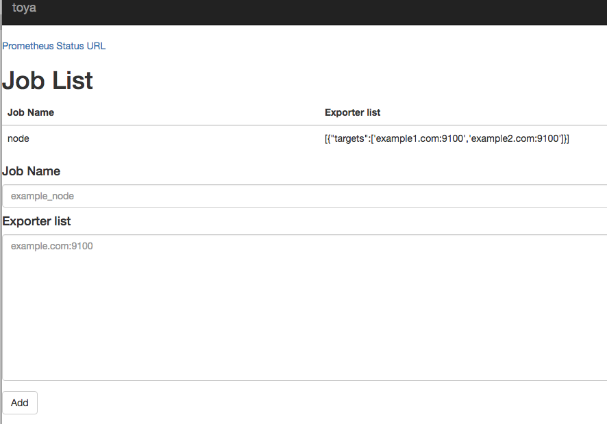

# toya
toya is the Web Application to edit prometheus configuration file.

toya derives from Lake Toya (Toyako) in Japan.



How to build
```
go get github.com/prometheus/prometheus/config
go get github.com/prometheus/log
go get gopkg.in/yaml.v2
go build toya.go
```

Help on flags
```
  -config.file string
    	prometheus configuration file name. (default "prometheus.yml")
  -exporter.list.dir string
    	file_sd_configs names file dir (default "/tmp")
  -listen-address string
    	The address to listen on for HTTP requests. (default ":12345")
  -log.format value
    	If set use a syslog logger or JSON logging. Example: logger:syslog?appname=bob&local=7 or logger:stdout?json=true. Defaults to stderr.
  -log.level value
    	Only log messages with the given severity or above. Valid levels: [debug, info, warn, error, fatal]. (default info)
  -prometheus.url string
    	prometheus (default "http://localhost:9090")
```
